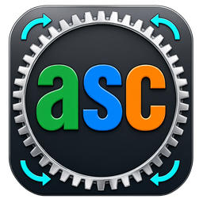
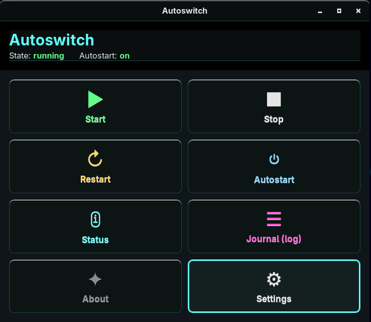
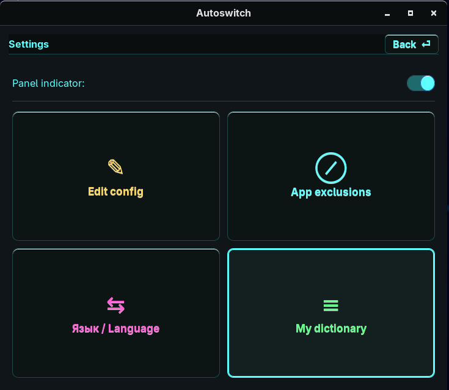
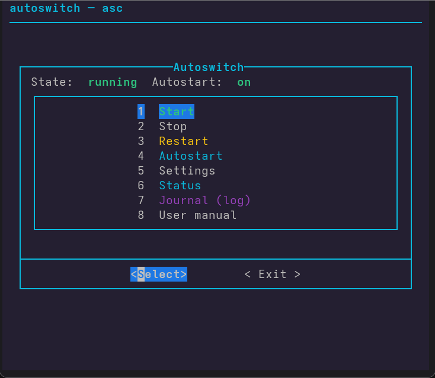
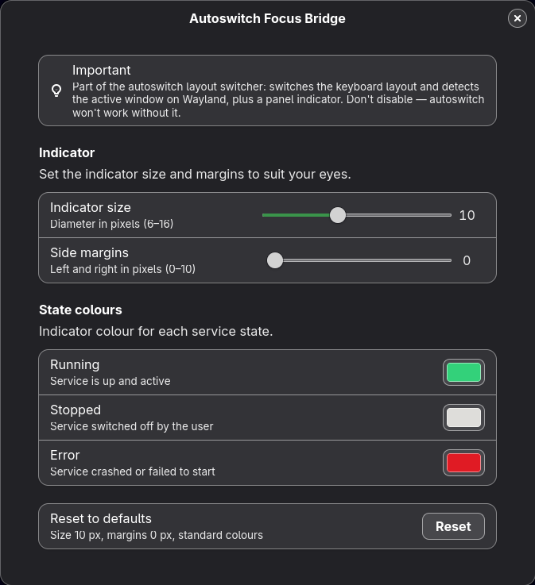
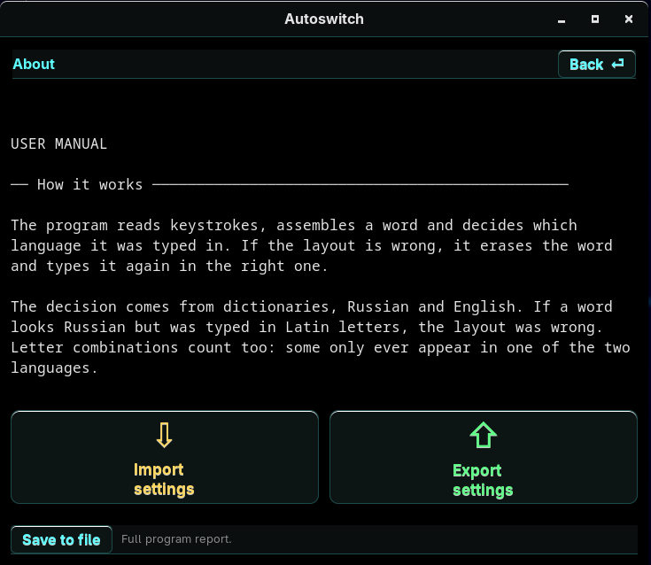

<p align="center">
  
</p>

<h1 align="center">Autoswitch Config</h1>

<p align="center">
  <a href="LICENSE"></a>
  <a href="https://github.com/Shah-man/autoswitch/releases/latest"></a>
  <a href="https://github.com/Shah-man/autoswitch/releases"></a>
  
</p>

A bilingual automatic keyboard layout switcher for Linux.

You type `ghbdtn` and `привет` appears on screen. You type `руддщ` and it
comes out as `hello`. The layout changes by itself; your hands stay on the
keyboard.

Nothing this complete existed for Linux before: X11 and Wayland alike, with
a panel indicator, its own dictionary, a window and a console menu, across
many distributions at once. This program fills that gap.

**Presentation:** [English][pres-en] · [Russian][pres-ru]



---

## Contents

- [Where it runs](#where-it-runs)
- [Security](#security)
- [Installation](#installation)
- [Installing on many computers](#installing-on-many-computers)
- [Controls](#controls)
- [What it does](#what-it-does)
- [Settings](#settings)
- [What gets installed](#what-gets-installed)
- [Where things live](#where-things-live)
- [Moving to another computer](#moving-to-another-computer)
- [User manual](#user-manual)
- [License](#license)

---

## Where it runs

The installer speaks several package managers, which means every
distribution that uses them.

**apt** — ALT Linux, Simply Linux, Astra Linux, Debian, Ubuntu, Kubuntu,
Xubuntu, Lubuntu, Ubuntu MATE, Linux Mint, Pop!_OS, Zorin OS, elementary OS,
KDE neon, Kali, Parrot, Raspberry Pi OS, Deepin, TUXEDO OS, Q4OS, PikaOS,
AnduinOS, MiniOS, MX Linux.

**dnf and yum** — RED OS, ROSA, Fedora, RHEL, CentOS, Rocky Linux,
AlmaLinux, Nobara, Ultramarine.

**pacman** — Arch, Manjaro, EndeavourOS, CachyOS, Garuda, Omarchy,
BigLinux, Bluestar, SteamOS.

**zypper** — openSUSE Leap, openSUSE Tumbleweed, SUSE Linux Enterprise.

Desktops: GNOME, KDE Plasma, XFCE, Cinnamon, MATE, LXQt, Hyprland, sway and
others built on wlroots. Both display protocols: X11 and Wayland.

The one hard requirement is **systemd** — the program runs as a service.
Distributions that deliberately went without it, such as antiX, Void, Artix
and Devuan, are therefore out. NixOS installs software its own way, so the
installer is no good there either.

Everything else — hunspell dictionaries, keyboard access, the libraries the
window needs — the installer pulls in by itself.

---

## Security

The program reads your keyboard, so trust is the question that matters
most. That is why the source is open and can be read end to end.

- **Not a single compiled file in the archive.** Text only: bash and
  python. No package to unpack, no binary to disassemble — open it and
  read, line by line.

- **Passwords are neither switched nor recorded.** Input longer than six
  characters that mixes letter cases with digits or symbols is treated as a
  password, and the program steps aside. Such input never reaches the log —
  not even with debug logging turned on. The same goes for card numbers and
  any input with digits inside it.

- **A password started in Cyrillic is moved to Latin.** A capital letter
  after a lowercase one — `myPassword` — is a signal visible by the third
  character, long before six are typed. People do not write words that way;
  passwords and machine names do it all the time. Seeing that in a Cyrillic
  layout, the program switches to Latin, because passwords are almost always
  English. The input still counts as a password and still stays out of the
  log.

- **What you type never reaches the system journal.** The program keeps its
  own log in your home directory, where you can see it and clear it at any
  moment.

- **Nothing leaves your machine.** No telemetry, no update checks, no
  licence checks. The program makes no network requests at all.

**About privileges.** The service runs as root: there is no other way in
Linux to read the keyboard device and type the corrected word back.

So what matters is not which privileges it holds but what it does with
them — and that is visible in the code:

- what you type stays in the program's own log, never in the system one;
- passwords are neither parsed nor written down;
- the program never touches the network;
- everything the window and the console ask to do as root — editing the
  config or the dictionary, controlling the service — goes through a
  separate helper, `asc-helper`, with a fixed list of actions. Arbitrary
  commands are never run as root.

---

## Installation

```bash
curl -LO https://github.com/Shah-man/autoswitch/releases/latest/download/autoswitch.tar.gz
tar xzf autoswitch.tar.gz
cd autoswitch
sudo ./installasc
```

The first line downloads the latest release. If your browser already
fetched the archive, start from the second.

Unpack it wherever you like — Downloads, a flash drive, anywhere. The
program installs itself into the system and puts a copy of its sources in
`~/Applications/autoswitch`, so it can be reinstalled later without an
internet connection.

The installer asks for a language, checks dependencies, installs the
missing ones and enables the service. If your system has only one keyboard
layout configured, it says so: there would be nothing to switch to, and a
second layout needs adding in your keyboard settings.

On GNOME the extension starts working after you log out and back in.

### Verifying the archive

Every release page lists the archive's checksum. It lets you confirm the
file arrived intact and is the one that was published, not something
swapped along the way:

```bash
sha256sum autoswitch.tar.gz
```

The command prints 64 characters — compare them with the sum on the release
page. A match means all is well. No match means the archive is damaged or
not ours: do not install it, download it again.

A single changed byte rewrites the whole sum, so an archive cannot be
altered unnoticed.

Uninstalling uses the same installer:

```bash
sudo ./installasc --uninstall
```

---

## Installing on many computers

Settings travel by themselves if you put them next to the installer.

**1.** Set one machine up the way you want it and export:
`asc` → Settings → Export settings. You get a file named
`autoswitch-settings-DATE.txt`.

**2.** Put that file next to the installer — either inside the unpacked
folder or beside the archive; the installer looks in both places.

**3.** On every machine, run the ordinary installation:

```bash
sudo ./installasc
```

The installer finds the file, takes the language from it and applies the
settings together with the dictionary. It does not ask about the language:
that choice was already made when you exported.

```
  settings file found: autoswitch-settings-20260917.txt
    language taken from the file: en
    settings applied
    dictionary: words added: 42
```

With no such file around, installation runs as usual and asks about the
language.

---

## Controls

There are three ways to drive the program, all equal — pick whichever suits
you.

**The panel indicator.** Shows whether the service is running. A click
opens a menu: start, stop, settings. The program window opens from here
too.

**The window.** Opens from the panel indicator or from your applications
menu, where it is called "Autoswitch". From a terminal it is `asc-gui`.

Everything inside is tiles: start, stop, autostart, status, journal,
settings, manual.

**Tiles can be dragged with the mouse** — arrange them as you like and the
order is remembered. What you use often ends up within reach, what you
rarely need moves out of the way.



**The console.** `asc` opens a menu in the terminal with everything the
window offers. For scripts there are short commands:

```bash
asc start | stop | restart | status
asc enable | disable      # autostart
asc log                   # journal
asc config                # settings
asc help                  # list of commands
```

`asc help` also prints the reinstall and uninstall commands, with the full
path, so you never have to remember where you installed from.



---

## What it does

- **Switches as you type.** The correction usually lands on the space bar,
  but when the language is clear from the first letters the layout changes
  right away, mid-word.

- **Switches on a single Shift.** Press Shift, release it, touch nothing
  else — the layout changes. It works independently of the system shortcut,
  so your usual key combination stays yours.

- **Can be undone.** When the program gets it wrong, press Shift twice in a
  row, or Pause. The word comes back as you typed it and goes into "My
  dictionary": it will be left alone from then on. That is how the
  dictionary fills up — on its own, as you work.

- **Lets you edit the dictionary by hand.** Add your own words, look through
  the list, edit the file as a whole or clear it — from the window or the
  console.

- **Keeps out of the way where it should.** A terminal, a code editor, a
  program console — such windows go into the exclusions, and inside them the
  program stays silent. Pick a window from the list of open ones, add the
  one currently in focus, or take the ready-made set for Steam games.

- **Fixes two leading capitals.** `HEllo` becomes `Hello`. Only when the
  corrected word is in the dictionary, so `IDs` and `PCs` are left intact.

- **Knows when it is not looking at a word.** Numbers, addresses, commands
  and machine names all abort the analysis.

- **Speaks two languages.** Russian and English. The language of the window,
  the console, the log and the manual switches at any moment, on the fly.

---

## Settings

The file is `/etc/autoswitch/config`, and every key is explained right
there in it. The format is plain: `key=value`, one key per line.

Open it with `asc` → Settings → Edit config, or in the program window under
Settings → Edit config. The service restarts itself after an edit.

| Key | Example | What it does |
|---|---|---|
| `start_layout` | `start_layout=us` | layout at startup: `us` or `ru` |
| `min_word_length` | `min_word_length=1` | how long a word must be before it is considered |
| `show_indicator` | `show_indicator=on` | the panel indicator |
| `fix_two_capitals` | `fix_two_capitals=on` | fix `HEllo` into `Hello` |
| `debug_log` | `debug_log=off` | verbose log for troubleshooting |
| `log_max_size` | `log_max_size=5` | log limit in megabytes, `0` for no limit |
| `terminal` | `terminal=konsole` | which terminal opens the console menu |
| `ui_lang` | `ui_lang=en` | language of the window, console and log |
| `exclude_apps` | `exclude_apps=konsole,code` | windows where the program stays silent |

---

## What gets installed

| What | Why |
|---|---|
| the `autoswitch.service` unit | the program itself |
| `asc`, `asc-gui` | the console menu and the window |
| `asc-helper` + a polkit rule | a fixed set of actions that need root |
| the panel indicator | service state and a quick menu |
| a GNOME extension | detecting the active window for exclusions |
| a KDE plasmoid and KWin script | the same thing on Plasma |

The extension and the plasmoid are installed only where the matching
desktop is present. They exist for exactly one purpose: to tell which
window is active, so that application exclusions work.

The indicator's looks can be adjusted: its size and a colour for each
service state.



---

## Where things live

```
/etc/autoswitch/config             settings
/etc/autoswitch/learned.txt        my dictionary
~/Applications/autoswitch.logs/    log
~/Applications/autoswitch          sources
```

The sources are laid out there so the program can be reinstalled without an
internet connection: go to `~/Applications/autoswitch` and run
`sudo ./installasc`. The previous build is not lost — it moves to
`autoswitch.bak` next to it, and you can always go back.

---

## Moving to another computer

Export puts your settings and "My dictionary" into a single text file, and
import takes it back. Settings are replaced; the dictionary is merged —
your own words stay, the imported ones are added.

It is an ordinary text file: open it and see exactly what you are carrying
over.

If the program is not installed on the new computer yet, you do not need
the import at all — put the file next to the installer and the settings
arrive along with the installation.

---

## User manual

The full manual is built into the program, in both languages: in the window
below the description, in the console as item 8 of the main menu.



Thirteen sections: how it works, switching, undoing a correction, my
dictionary, application exclusions, the program window, the panel
indicator, two leading capitals, security, logging, settings, where things
live, moving to another computer.

---

## License

GPLv3. The program reads your keyboard, so being open here is not a
decoration but a condition of trust.

https://github.com/Shah-man/autoswitch

[pres-en]: https://github.com/Shah-man/autoswitch/releases/download/v1.0.0/autoswitch-presentation-en.pdf
[pres-ru]: https://github.com/Shah-man/autoswitch/releases/download/v1.0.0/autoswitch-presentation-ru.pdf
